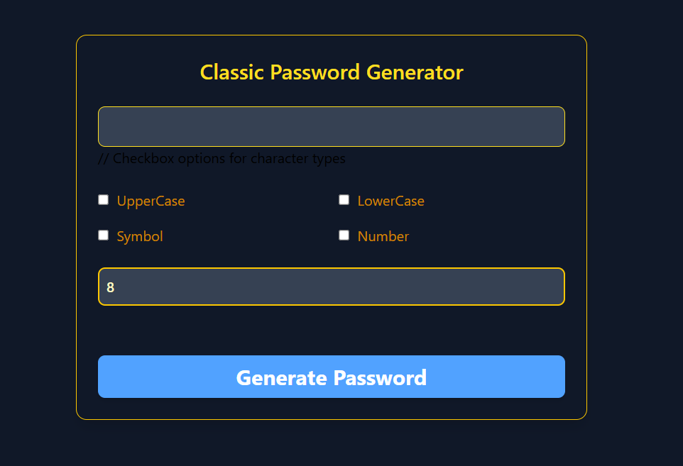

# React + Vite

# 🔐 Classic Random Password Generator

A minimal yet powerful **Random Password Generator** built using **React** and **Tailwind CSS**, allowing users to generate secure and customizable passwords with ease.

---

## 🛠 Features

- ✅ Choose character types: **Uppercase**, **Lowercase**, **Numbers**, **Symbols**
- ✅ Set password length (4 to 20)
- ✅ View password in plain text or masked
- ✅ Copy to clipboard with visual feedback
- ✅ Real-time **password strength indicator**
- ✅ Clean UI with Tailwind CSS

📂 Project Structure
src/
├── App.js         # Main application component
├── index.js       # Entry point
├── index.css      # TailwindCSS and global styles

🧠 Technologies Used

⚛️ React
🎨 Tailwind CSS
📦 lucide-react icons (for UI controls)

# How to clone it and run on local machine

Make sure the following are installed on your system:

- Node.js (v14 or above)
- Git

Open your terminal and run:

- git clone https://github.com/Siddharth3271/Password-Generator.git
- cd Password-Generator

Install Dependencies

- npm install

Start the Development Server

- npm run dev

